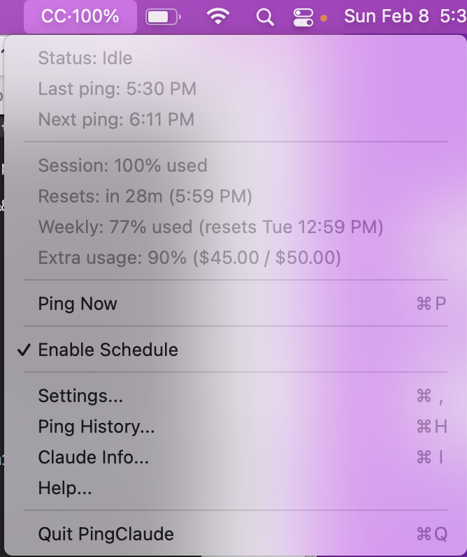
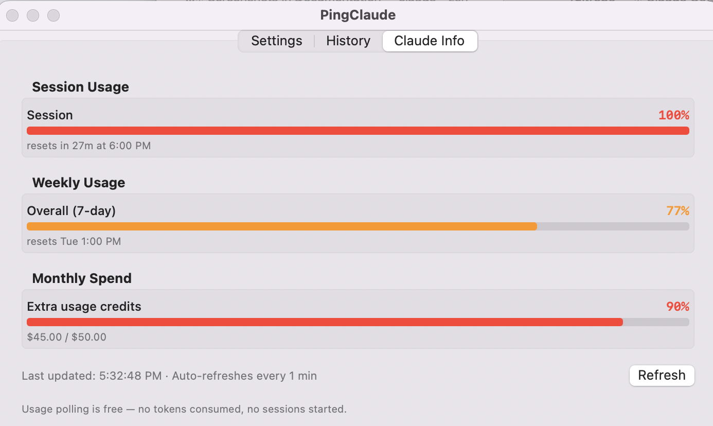
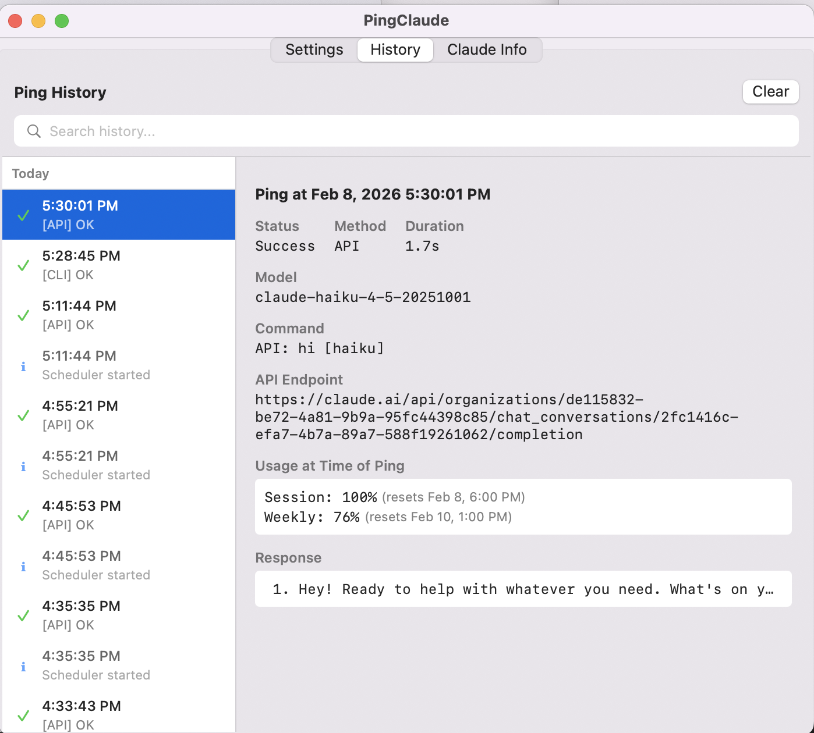
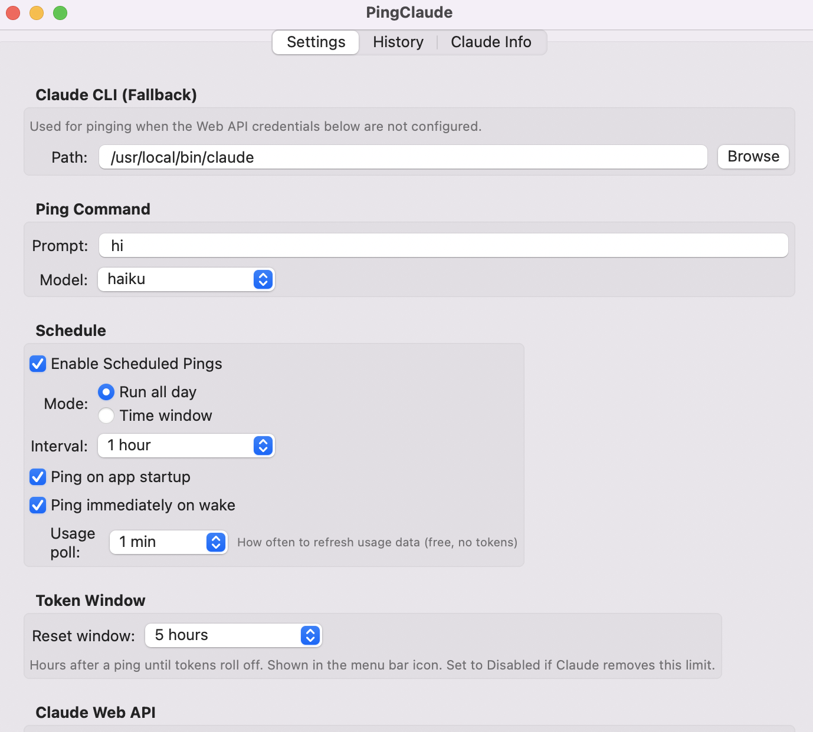
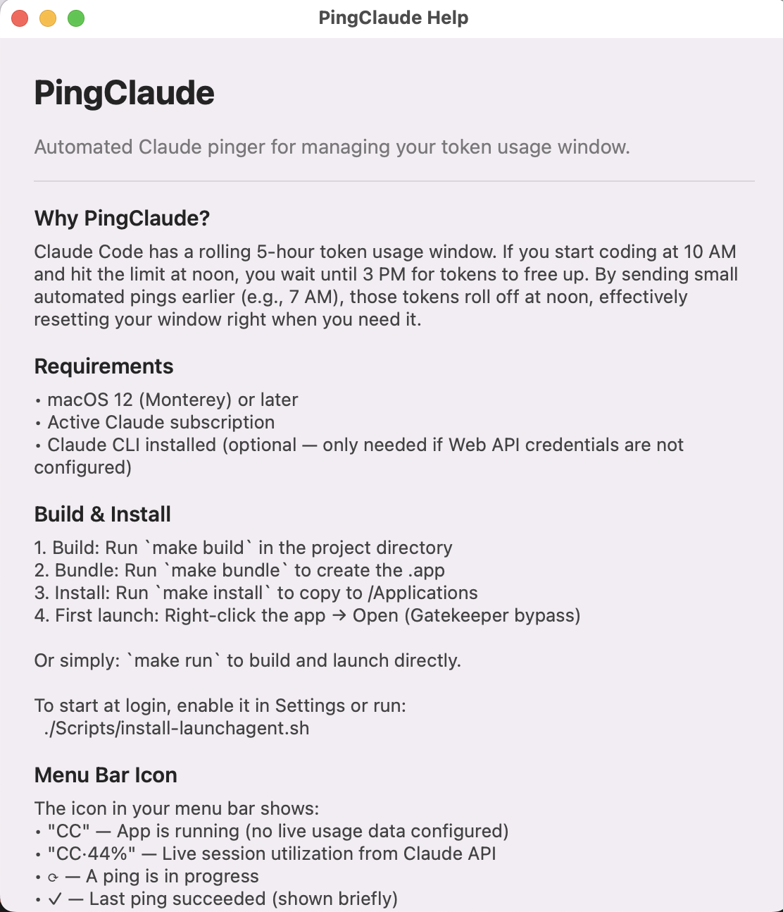

# PingClaude

A macOS menu bar app that automatically pings Claude to manage your rolling token usage window, with optional live usage tracking from the Claude Web API.

## Why?

Claude Code has a rolling 5-hour token usage window. If you start coding at 10 AM and hit the limit at noon, you have to wait until 3 PM for those tokens to free up. By sending small automated pings earlier (e.g., 7 AM), those tokens roll off at noon, effectively resetting your window right when you need it.

PingClaude automates this strategy — it runs in your menu bar, pings Claude on a schedule, and can show your real-time session utilization percentage and exact reset time.

## Screenshots

| Menu Bar | Claude Info | Ping History |
|----------|-------------|--------------|
|  |  |  |

| Settings (top) | Settings (bottom) | Help |
|----------------|-------------------|------|
|  |  |  |

## Requirements

- **macOS 12** (Monterey) or later
- **Swift 5.7.2+** — included with Xcode Command Line Tools (for building)
- **Active Claude subscription**
- **Claude CLI** — optional fallback; only needed if Web API credentials are not configured

To install Command Line Tools if you don't have them:

```bash
xcode-select --install
```

## Build & Run

```bash
# Build the binary
make build

# Build + assemble .app bundle
make bundle

# Build + assemble + launch
make run

# Install to /Applications
make install

# Clean build artifacts
make clean
```

On first launch, macOS Gatekeeper may block the app. Either:
- Right-click the app -> **Open**, or
- Run `xattr -cr /Applications/PingClaude.app` before launching

## Usage

PingClaude lives in your **menu bar** (no Dock icon). Click the icon to access all features.

### Menu Bar Icon

| Icon | Meaning |
|------|---------|
| `CC` | App is running (no live usage data configured) |
| `CC·44%` | Live session utilization from Claude Web API |
| `⟳` | Ping in progress |
| `✓` | Last ping succeeded (shown briefly) |
| `⚠` | Last ping failed (shown briefly) |

To see the live percentage, configure the **Claude Web API** in Settings (see below).

### Menu Items

- **Status** — Current state (Idle, Pinging, Success, Error)
- **Last ping** — When the most recent ping ran
- **Next ping** — When the next scheduled ping will fire
- **Session / Weekly / Extra usage** — Live usage metrics (requires Web API)
- **Ping Now** (⌘P) — Manually trigger a ping
- **Enable Schedule** — Toggle automatic pinging on/off
- **Settings** (⌘,) — Configure all options
- **Ping History** (⌘H) — View ping history with search and date grouping
- **Claude Info** (⌘I) — Usage dashboard with progress bars
- **Help** (⌘?) — In-app documentation
- **Quit PingClaude** (⌘Q) — Exit the app

### Tabbed Window

Settings, Ping History, and Claude Info share a single tabbed window. Opening any of these from the menu bar switches to the corresponding tab.

### Settings

**Claude CLI (Fallback):**
- **Path** — Location of the `claude` executable. Only used when Web API credentials are not configured.

**Ping Command:**
- **Prompt** — Text sent to Claude (default: `hi`). Kept minimal to use few tokens.
- **Model** — Which model to use (`haiku` recommended for minimal token cost)

**Schedule:**
- **Enable** — Turn automatic pinging on/off
- **Mode** — "Run all day" (pings whenever awake) or "Time window" (specific hours only)
- **Interval** — Time between pings (15 minutes to 4 hours)
- **Ping on startup** — Immediately ping when the app first launches
- **Ping on wake** — Immediately ping when your computer wakes from sleep
- **Usage poll** — How often to refresh usage data (15 sec to 5 min, default: 1 min). This is free — no tokens consumed, no sessions started.

**Token Window:**
- **Reset window** — Hours until tokens roll off (default: 5 hours). Set to 0 (Disabled) if Claude removes this rolling window.

**Claude Web API:**

Enables two features: API-based pinging (no CLI needed) and live usage tracking (session %, weekly %, monthly spend). Usage polling is free — it reads your account metrics without consuming any tokens or starting a session. Click the `?` icon in Settings for step-by-step setup instructions.

- **Org ID** — Your organization UUID. Stays constant for your account.
- **Session Key** — Your `sessionKey` cookie. Auto-refreshes on each API poll, so once entered it stays valid.

**Storage:**
- **Log folder** — Where ping history is saved (default: `~/Library/Logs/PingClaude/`)
- **Max size** — When logs exceed this limit, the oldest half of records are pruned automatically

**General:**
- **Launch at login** — Start PingClaude automatically (uses SMAppService on macOS 13+, LaunchAgent on macOS 12)

### Claude Info

A visual dashboard showing:
- Session usage with colored progress bar (green → orange → red)
- Weekly usage with per-model breakdowns (Opus, Sonnet, Cowork, etc.)
- Monthly extra-usage spend with credits used vs. limit
- Reset countdowns and times
- Auto-refreshes on the configured usage poll interval, plus a manual Refresh button

Usage polling is free — no tokens consumed, no sessions started. Requires Claude Web API credentials to be configured in Settings.

### Ping History

A split-view showing every ping:
- **Search bar** — Filter by status, model, response text, error messages
- **Date grouping** — Records organized under "Today", "Yesterday", or day name headers
- **Auto-select** — Most recent record selected automatically
- **Clear confirmation** — Destructive clear requires confirmation
- **Detail pane** — Click any ping to see full details: timestamp, status, duration, model, command, usage snapshot, and Claude's complete response

System events (scheduler start/stop, sleep/wake) are also shown inline.

## Files & Locations

| What | Where |
|------|-------|
| App | `/Applications/PingClaude.app` (after `make install`) |
| Event log | `~/Library/Logs/PingClaude/pingclaude.log` |
| Ping history | `~/Library/Logs/PingClaude/ping_history.json` |
| Settings | `~/Library/Preferences/` (via UserDefaults) |
| LaunchAgent | `~/Library/LaunchAgents/com.pingclaude.app.plist` |

## Launch at Login

**macOS 13+:** Toggle "Launch at login" in Settings — uses the native `SMAppService` API.

**macOS 12:** Run the included script:

```bash
./Scripts/install-launchagent.sh
```

To remove:

```bash
./Scripts/uninstall-launchagent.sh
```

## Architecture

The app is built with:
- **AppKit** for the menu bar (`NSStatusItem`) and window management
- **SwiftUI** for all views (Settings, History, Claude Info, Help)
- **Combine** for reactive updates between services
- **URLSession** to ping via Claude Web API and poll usage metrics
- **Swift `Process`** as CLI fallback to run `claude` with a 30-second timeout

No App Sandbox — required to execute the `claude` CLI as a subprocess. This is the default when building with `swiftc` outside of Xcode.

### Source Files

```
Sources/PingClaude/
├── main.swift              # NSApplication bootstrap
├── AppDelegate.swift       # App lifecycle, service init, App Nap prevention
├── Constants.swift         # Keys, defaults, bundle ID
├── StatusBarController.swift   # Menu bar icon, menu, Combine observers
├── PingService.swift       # API ping + CLI fallback with timeout
├── SchedulerService.swift  # Timer scheduling + sleep/wake handling
├── UsageService.swift      # Polls claude.ai usage API for live metrics
├── SettingsStore.swift     # UserDefaults-backed @Published config
├── SettingsView.swift      # SwiftUI settings form
├── PingHistoryStore.swift  # JSON-backed ping records
├── PingHistoryView.swift   # SwiftUI split view: list + detail + search
├── ClaudeInfoView.swift    # Usage dashboard with progress bars
├── MainTabView.swift       # TabView hosting Settings, History, Claude Info
├── MainWindow.swift        # Single tabbed NSWindow
├── EditableWindow.swift    # NSWindow subclass for Cmd+C/V/X/A support
├── LogStore.swift          # File-backed event log with size management
└── HelpWindow.swift        # In-app help documentation
```

## Log Format

Ping history is stored as JSON (`ping_history.json`):

```json
[
  {
    "id": "...",
    "timestamp": "2026-02-07T12:00:01Z",
    "status": "success",
    "duration": 3.2,
    "command": "API: hi [haiku]",
    "response": "Hello! How can I help you today?",
    "errorMessage": null,
    "isSystemEvent": false,
    "method": "api",
    "model": "claude-haiku-4-5-20251001"
  }
]
```

When the total log size exceeds the configured maximum (default 10 MB), the oldest half of records are automatically pruned.
